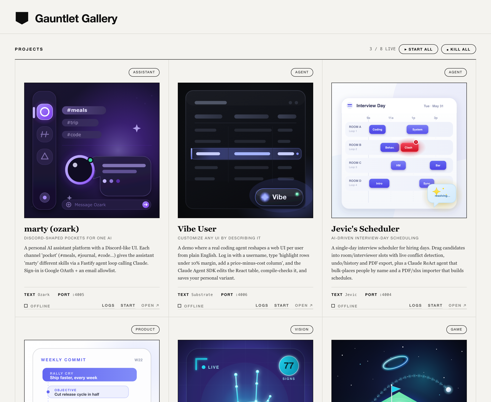

# Gauntlet Gallery

A one-page launcher for **everything you've built**. Hit **Start All** and demo
any project in one click — each runs on its own port, with its own cover art.



## Quick start

**1. Clone it.**

```bash
git clone git@github.com:cartertune/gauntlet-gallery.git
```

**2. Install the skill** (one command):

```bash
cp -r gauntlet-gallery/skill/gallery ~/.claude/skills/gallery
```

**3. In Claude Code, ask for a gallery** — point it at your projects folder:

```
/gallery make a gallery of everything in ~/projects
```

That's it. The skill finds your projects, gives each a port, and opens the
gallery in your browser. Then just hit **Start All**.

> No Claude Code? See [By hand](#b-by-hand-no-skill-needed) below.

---

## Two ways to use it

### A. With the `/gallery` skill (recommended)

This is the [Quick start](#quick-start) above. Once installed, run `/gallery`
(or describe what you want) and the skill will:

1. Ask which directory / which projects to include.
2. Inspect each project (Vite, Next, CRA, FastAPI, static, …) to find how to
   launch it and assign each a non-conflicting port.
3. Scaffold the app and launch it **immediately** with clean placeholder art.
4. Generate a bespoke, full-color cover plate for each app in the background and
   swap them in live.

Prefer the skill scoped to one project instead of all of Claude Code? Install it
project-level: `mkdir -p .claude/skills && cp -r gauntlet-gallery/skill/gallery .claude/skills/gallery`

### B. By hand (no skill needed)

```bash
cp -r template my-gallery
cd my-gallery
cp gallery.config.example.json gallery.config.json
# edit gallery.config.json: list your projects, their dirs, and ports
node server.js
```

Open the printed URL (default **http://localhost:4000**).

A helper can guess a project's launch command + default port for you:

```bash
node lib/inspect.js /absolute/path/to/some-project
```

---

## Configuration

Everything lives in `gallery.config.json` (see
`template/gallery.config.example.json` for a full, commented-by-example file):

```jsonc
{
  "title": "Gauntlet Gallery",     // masthead text
  "controlPort": 4000,             // the gallery's own port
  "projects": [
    {
      "id": "my-app",              // unique kebab id
      "name": "My App",
      "tagline": "what it does",
      "essence": "2-4 sentences shown as the card body",
      "category": "WEB",           // small pill label
      "accent": "#6366f1",         // plate / monogram color
      "port": 4001,                // the web port you open
      "readyPort": 4001,           // port polled for "live" (default: port)
      "openPath": "/",             // appended when opening (e.g. "/?demo")
      "notes": "launch caveats shown on the card",
      "procs": [                   // one or more processes to spawn
        { "label": "web", "cmd": "npm",
          "args": ["run","dev","--","--port","4001","--strictPort"],
          "cwd": "/abs/path/to/my-app" }
      ]
    }
  ]
}
```

### Port conventions

- Control server: **4000**.
- Each project's **web** UI: **4001, 4002, 4003, …**
- A project's **backend/data** service (FastAPI, a second server, etc.): its own
  port outside the 40xx web range (e.g. `8001+`), or the exact port a hardcoded
  dev-proxy expects.

Port overrides are always passed as **CLI flags / env vars** at launch — the
gallery never edits your projects' own config files.

---

## How it works

A static page can't spawn processes, so `server.js` is a tiny Node control
server that owns the child dev-servers, tracks them, and reports liveness by
polling each project's port (it checks both IPv4 and IPv6, since Vite binds
`::1` while Next/uvicorn bind `127.0.0.1`).

| File | Role |
|---|---|
| `server.js` | control server + start/stop/status/order API |
| `index.html` | the FYRRE editorial gallery UI |
| `projects.js` | reads `gallery.config.json` (single source of truth) |
| `thumbnails.js` | the cover plates (monograms → essence art) |
| `lib/monogram.js` | instant placeholder plate generator |
| `lib/inspect.js` | project auto-detect (type / launch cmd / port) |

- **Start All / Kill All** at the top; per-card **Start / Stop**, **Logs**, **Open**.
- **Drag a tile onto another → they swap**, animated (FLIP), order saved to
  `order.json`.
- Cover plates are always shown in full color; running state is shown by the ink
  status mark + `LIVE` / `OFFLINE` label.
- `Ctrl-C` in the server terminal stops the gallery **and every project it
  launched** (it signals each child's whole process group).

---

## Caveats

- **First boot is slow.** Vite/Next/Spring dev servers can take 10–20s the first
  time; the status dot stays "BOOTING" until the port answers.
- **Data dependencies are yours.** If a project needs a Postgres/Docker
  container or API keys in a `.env`, the gallery surfaces that as a card note
  but does not provision it — start those yourself.
- **Node ≥ 18** for the control server. Each project still needs its own tool
  installed (npm deps, a Python venv, etc.).

---

## Repo layout

```
.
├── README.md
├── skill/gallery/        # the /gallery Claude Code skill
│   ├── SKILL.md
│   └── plate-prompt.md   # "capture the essence" cover-art direction
└── template/             # the app, copied per gallery
    ├── server.js  index.html  projects.js
    ├── lib/{monogram.js, inspect.js}
    ├── package.json
    └── gallery.config.example.json
```

MIT-licensed. Built for the cohort — fork it, theme it, ship it.
